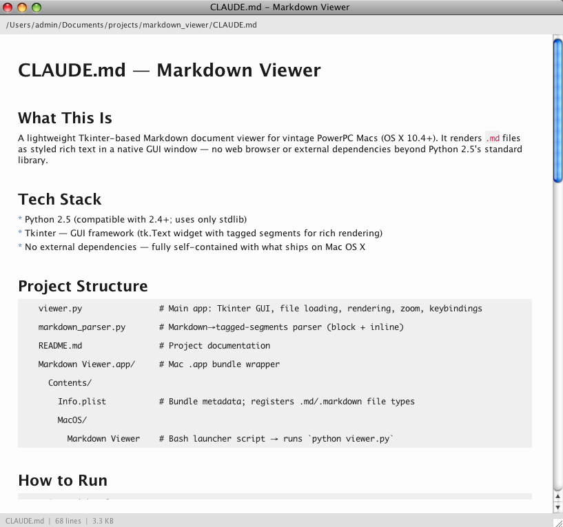

# Markdown Viewer for PowerPC Mac

A lightweight Markdown viewer built with **Python 2.5** and **Tkinter**, designed
to run on vintage PowerPC Macs running Mac OS X 10.5 Leopard.



## Features

- **Rich text rendering** of Markdown documents
- Support for common Markdown syntax:
  - **Bold**, *italic*, and ***bold italic*** text
  - `Inline code` and fenced code blocks
  - Headings (H1 through H6)
  - Ordered and unordered lists
  - Blockquotes
  - Horizontal rules
  - ~~Strikethrough~~
- Zoom in/out with keyboard shortcuts
- Reload files on the fly
- Clean, readable interface

## Requirements

- Mac OS X 10.4+ (Tiger or Leopard)
- Python 2.5+ with Tkinter
- PowerPC or Intel Mac

## Usage

Open the viewer with no arguments to see the welcome screen:

```
python viewer.py
```

Or pass a Markdown file directly:

```
python viewer.py README.md
```

### Keyboard Shortcuts

| Shortcut  | Action       |
|-----------|--------------|
| Cmd+O     | Open file    |
| Cmd+R     | Reload file  |
| Cmd+W     | Close window |
| Cmd++     | Zoom in      |
| Cmd+-     | Zoom out     |
| Cmd+0     | Reset zoom   |
| Cmd+A     | Select all   |
| Cmd+C     | Copy         |

## Code Example

Here's a simple Python snippet:

```python
def fibonacci(n):
    """Generate Fibonacci sequence up to n."""
    a, b = 0, 1
    while a < n:
        print a,
        a, b = b, a + b

fibonacci(1000)
```

## Architecture

The app has two main components:

1. **`markdown_parser.py`** — A lightweight Markdown parser that converts
   Markdown text into tagged segments
2. **`viewer.py`** — The Tkinter GUI application that renders the tagged
   segments with proper formatting

> This viewer was built to be self-contained with no external dependencies
> beyond what ships with Python 2.5 on Mac OS X.

## How It Was Built

This application was written entirely on a PowerPC Mac G4 running Mac OS X 10.5 Leopard, with the help of [Relic](https://github.com/reichenbach/relic-cli) — a lightweight Claude client for vintage Macs. Relic provided an AI coding assistant directly in the Leopard Terminal, and Claude designed, wrote, and debugged every file in this project on that machine.

No modern IDE, no web browser, no internet access on the Mac itself — just a Python 2.5 terminal client talking to Claude through a relay server on the local network.

---

*Made with care for the PowerPC Mac community.*